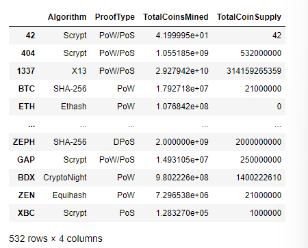
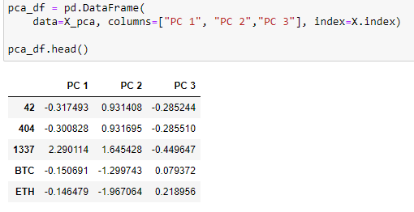
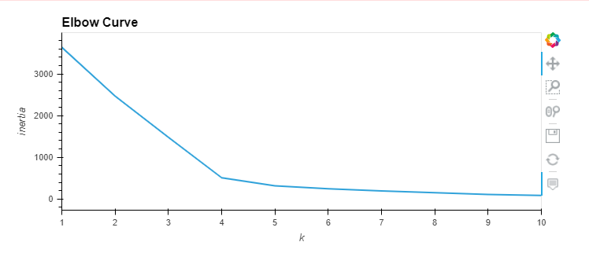
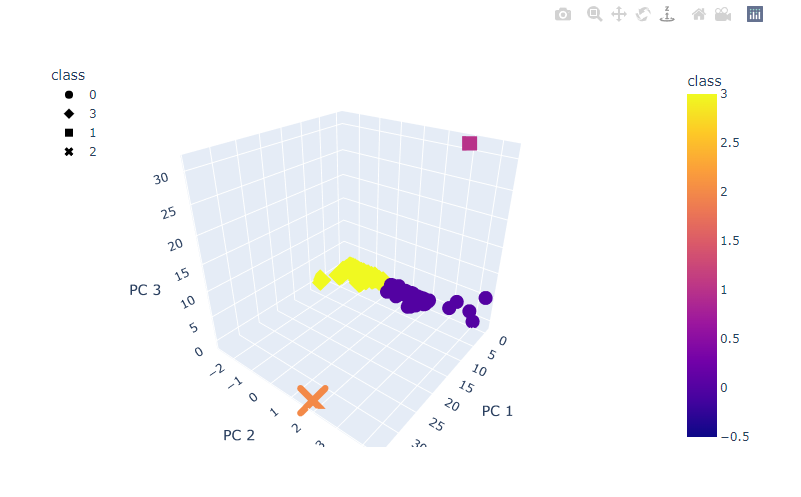
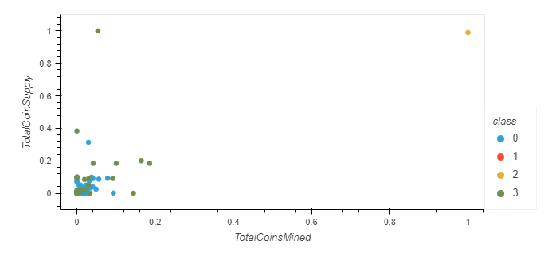

# Cryptocurrencies

## Challenge Overview
### Overview of the Cryptocurrency Analysis

The purpose of this analysis was to utilize unsupervised learning to analyze cryptocurrency data.


## Resources
Dataset:
- crypto_data.csv

## Results

First, the dataset was read in from a csv file and preprocessed to prepare for a PCA analysis:

Original Dataset:


Modified Dataset after Preprocessing:



Next, the data was scaled and PCA analysis was performed on the modified data, reducing the dimensions to three (3) principal components:



An elbow curve was created using Pandas hvplot to find the best value for K:



Then, the K-means algorithm was run to predict the K clusters for the data, with K=4:

```
# Initialize the K-Means model.
model = KMeans(n_clusters=4, random_state=0)

# Fit the model
model.fit(pca_df)

# Predict clusters
predictions = model.predict(pca_df)
```

The results were visualized using both 3D and 2D scatter plots:






## Summary

This analysis grouped cryptocurrencies into 4 groups, which were then visualized to provide further context.


